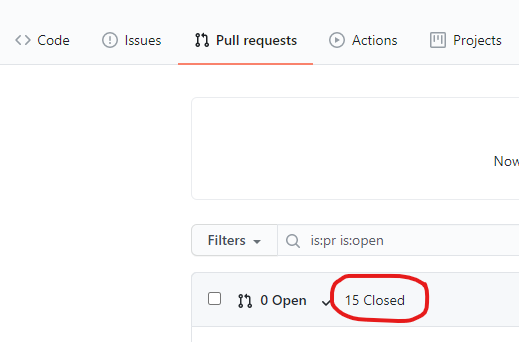
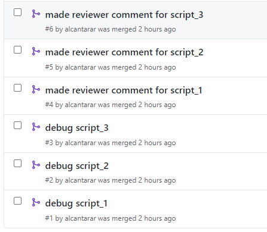
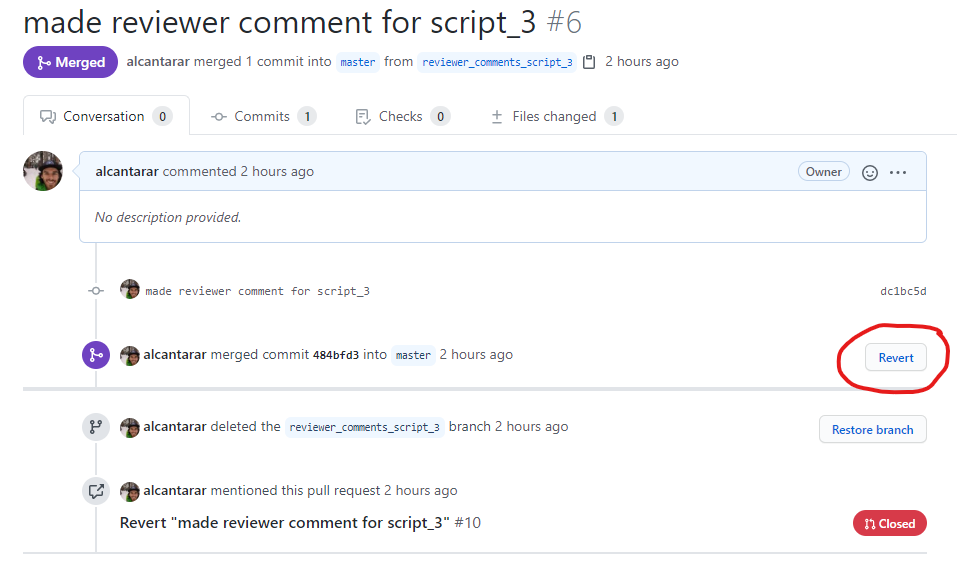
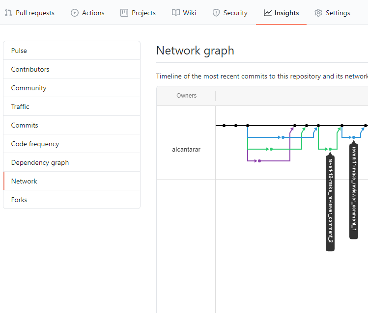

# Breakout 3

Unfortunately, the figure got rejected from Nature after revisions. But fear not! There are other fantastic journals to apply to. 
Your team decides that all of the comments made by the previous reviewers did not make sense, and you want to change them
back before resubmitting to the next best option: Journal of Biomechanics.

## Undoing changes
It should be noted that there are **many** ways to undo changes with Git and GitHub. The following resources can help
with different levels of undoing changes:
* [How to undo (almost) anything with git](https://github.blog/2015-06-08-how-to-undo-almost-anything-with-git/)
* [Undoing Commits & Changes](atlassian.com/git/tutorials/undoing-changes)
* [Oh shit, Git!?!](ohshitgit.com)

For the current example, one of the reviewers suggested some changes that need to be undone. Since all changes were
made in separate branches and merged into the `master` branch via Pull Requests, undoing these changes can be done by 
reverting each pull request on GitHub.

## Reverting a Recent Pull Request
1. Click on the "Pull requests" tab on your repository page on www.github.com. GitHub automatically filters Pull Requests
to only show open (incomplete) ones. Click on the "Closed" to view completed Pull Requests:

    

    You should see all of the pull requests completed during the tutorial. Descriptive branch names allows you to quickly identify
    what changes were made:

    

2. Select the Pull Request that you created to complete the reviewer's edits and click "Revert":

    

    **What is going on here?** You are effectively creating a new Pull Request that does the exact opposite of your past Pull Request. This is different
    than just deleting the old Pull Request because the history of your repository is maintained. If, for whatever reason, you
    wanted to go back and see what changes you made because of the reviewer, you could. There may be instances where you want
    to erase a commit or Pull Request, but doing so is beyond the scope of this tutorial. 

3. Select "Create pull request". Note that the new Pull Request title autopopulated, explaining that this is reverting a
prior change. Then you can merge your new pull request by selecting "Merge pull request" and "Confrim merge" just like 
you did when merging branches earlier in the tutorial.

4. Delete branch.

## Visualizing Branches and Pull Requests
Your group has made several changes to your repository, and GitHub has a tool that helps visualize these changes.
Click on the "Insights" tab on your repostory page and then select "Network":


Hovering over the circles will reveal details about the commit and clicking on it will show the line-by-line changes. 
You can also see where branches originate from and when they were merged back into the `master` branch via a Pull Request.
In the picture above, we can also see that two branches were made to revert the reviewer comment changes made to script 1 and 2.

## Future Considerations: Project Management with GitHub
GitHub has many tools that help with project management, including [issue tracking](https://guides.github.com/features/issues/)
and [project boards](https://docs.github.com/en/github/managing-your-work-on-github/creating-a-project-board). We highly
recommend checking out the [GitHub Guides](https://guides.github.com/) for more information on GitHub project management
features. Check out the [issues page](https://github.com/alcantarar/ASB_Tutorial/issues) or 
[pull request pages](https://github.com/alcantarar/ASB_Tutorial/pulls?q=is%3Apr+is%3Aclosed) of the repository we used 
to make this tutorial for an example of how GitHub's features allow for remote collaboration.

## Further Considerations: Reverting Multiple Changes at Once
In this situation, there were 5 Pull Requests that needed to be undone. In the future, you may need to undo so many changes
that reverting each Pull Request becomes too cumbersome. In this case, you can identify a particular commit where everything
was how you want it now and undo all changes since then. You will not be deleting the changes made since then, but instead
creating a new commit that effectively undoes all the changes. This method maintains the repository history in case you need
to reference it at a later date.

Consider a repository with many changes (top commit is most recent):
```
Commit  Message
jn1239  'fix typo in feature 2'
3hncb9  'debug feature 1'
...
mn3290  'add feature 2'
980dfn  'add feature 1'
asedf9  'everything is debugged and working perfectly'
```
If you wanted to undo all the commits since `asedf9` while maintaining the history, you could checkout the `master` 
branch and then execute:
```
$ git checkout asedf9 .
```
Now your *local* repository is as it was at the `asedf9` snapshot. Because this differs from the most recent snapshot `jn1239`, 
you need to commit these new changes:
```
$ git commit -m "revert back to asedf9 because I don't want features 1 & 2 anymore"
```
And your new commit history would look like this:
```
Commit  Message
nds435  'revert back to asedf9 because I don't want features 1 & 2 anymore'
jn1239  'fix typo in feature 2'
3hncb9  'debug feature 1'
...
mn3290  'add feature 2'
980dfn  'add feature 1'
asedf9  'everything is debugged and working perfectly'
```

This is technically a viable solution for the current situtation, but undoing recent Pull Requests in GitHub allows each
team member to undo their changes instead of one person making an executive decision to revert the entire repository back
to a particular snapshot.